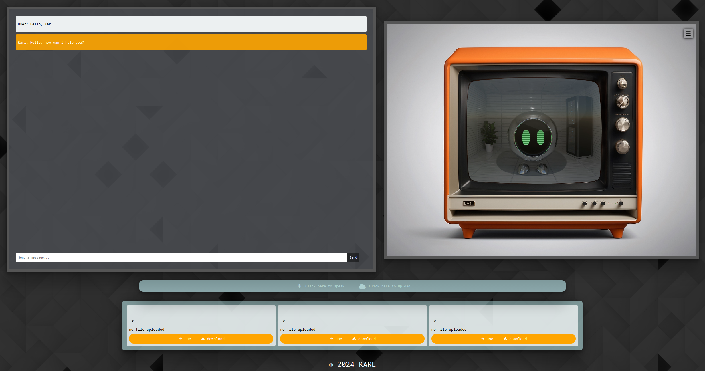

 <b>KARL Künstlicher Assistent repräsentiert durch LLM</b> 
  

 ---

Karl is a small robot living inside a tube television. With the help of a library called [Ollama](https://github.com/ollama/ollama), he can access artificial intelligences. Primarily, [Llava](https://ollama.ai/library/llava) and [Llama2](https://ollama.ai/library/llama2) are used, which operate in both image and text-based contexts. Users can have documents processed, get image descriptions, and analyze current websites through Karl. Llama2 has a large database that can be accessed through Karl.

---

## 🖥️ Features

- 🤖 - Local artificial intelligence
- 💬 - Chatbot function
- 🗣️ - Speech-to-text function
- 🖼️ - Image scanning
- 📄 - Document scanning
- 📷 - Webcam scanning

KARL's intelligence operates locally and can function without internet connectivity in theory; it can also be switched to other AI models and process various types of documents.

### 🕓 Planned Upcomming features

- 🔗 **Expanded File Type Integration:** Incorporate additional document formats such as docx or excel.
- 🤖 **AI-Powered Coding:** Utilize KARL as your primary tool for solving daily coding challenges.

## 📝Requirements

- Ubuntu version 22.04: 🐧🖥️2️⃣2️⃣.0️⃣4️⃣
- Minimum 20GB RAM: 💾2️⃣0️⃣GB
- Nvidia GPU for Ollama: 🎮💻🔥
- Minimum 10-core CPU: 💻🔟
- Google Chrome as the browser: 🌐🔍

## 📜 ⬇️ Installation guide

Coming soon

## 👥 The team

- [Marvin-VW](https://github.com/Marvin-VW)
- [Daniel-VW](https://github.com/Daniel-VW)
- [niklasprg](https://github.com/niklasprg)

## 💼 License

MIT License

Copyright (c) 2024 KARL

---

# Services
## Fonts:

- Roboto Mono: Used for code blocks and monospace text.
- Grape Nuts: Presumably used for specific stylized text elements.
  
## External Libraries and Scripts:
- Core CSS and JS from pyscript.net: custom styling and functionality.
- Font Awesome: Icon library for scalable vector icons.
- Webcam Easy: Script for handling webcam functionalities.

# Dependencies

## Node.js/Express:
- Express: Framework for building web applications with Node.js.
- Body Parser: Middleware for parsing incoming request bodies.
- Axios: Promise-based HTTP client for making requests.
  
## Python/Flask:
- Flask: Micro web framework for Python.
- Flask CORS: Extension for handling Cross-Origin Resource Sharing (CORS).
- Langchain: Custom library for language processing tasks.

# Scripts

## Web Page Loading:
- langchain.document_loaders.WebBaseLoader for loading web pages.
- langchain.text_splitter.RecursiveCharacterTextSplitter for text splitting.
  
## Embedding and Storing:
- langchain.vectorstores.Chroma for vector storage.
- langchain.llms.Ollama is used for language modeling.
  
## Flask App:
- Handles API endpoints for text processing and file handling.

<h4>© Copyright KARL 2024</h4>

